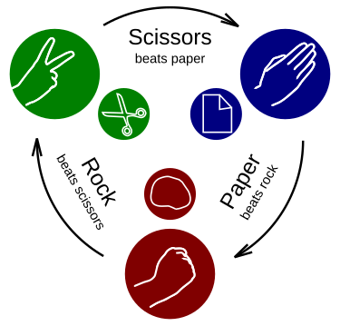

# **Rock Paper Scissors**🎮✊✋✌️ 
<p align="left">
    
    <br/>
    
## Introduction
Rock Paper Scissors is a classic hand game played between two players, where each simultaneously forms one of three shapes with their hand: rock, paper, or scissors. In this project, you play against the computer in a simple Python program. The computer makes a random choice, and the winner is determined based on the traditional rules of the game. 

## Requirements
Python 3.x
(No external libraries required)

## Project Structure
```
rock-paper-scissors/
│
├── src/
│   ├── game.py - the main game class
│
└── README.md
```

## How to Run
```python
python src/game.py
```
> The game continues until the user decides to quit by entering 'q'.
